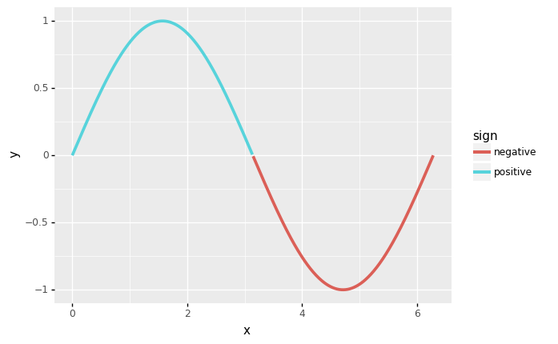

# datar

Port of [dplyr][2] and other related R packages in python, using [pipda][3].

Unlike other similar packages in python that just mimic the piping sign, `datar` follows the API designs from the original packages as possible. So that nearly no extra effort is needed for those who are familar with those R packages to transition to python.

<!-- badges -->
[![Pypi][6]][7] [![Github][8]][9] ![Building][10] [![Docs and API][11]][5] [![Codacy][12]][13] [![Codacy coverage][14]][13]

[Documentation][5] | [Reference Maps][15] | [Notebook Examples][16] | [API][17]

## Installtion

```shell
pip install -U datar
```

`datar` requires python 3.7.1+ and is backended by `pandas (1.2+)`.

## Example usage

```python
from datar import f
from datar.dplyr import mutate, filter, if_else
from datar.tibble import tibble

df = tibble(
    x=range(4),
    y=['zero', 'one', 'two', 'three']
)
df >> mutate(z=f.x)
"""# output
   x      y  z
0  0   zero  0
1  1    one  1
2  2    two  2
3  3  three  3
"""

df >> mutate(z=if_else(f.x>1, 1, 0))
"""# output:
   x      y  z
0  0   zero  0
1  1    one  0
2  2    two  1
3  3  three  1
"""

df >> filter(f.x>1)
"""# output:
   x      y
0  2    two
1  3  three
"""

df >> mutate(z=if_else(f.x>1, 1, 0)) >> filter(f.z==1)
"""# output:
   x      y  z
0  2    two  1
1  3  three  1
"""
```

```python
# works with plotnine
import numpy
from datar.base import sin, pi
from plotnine import ggplot, aes, geom_line, theme_classic

df = tibble(x=numpy.linspace(0, 2*pi, 500))
(df >>
   mutate(y=sin(f.x), sign=if_else(f.y>=0, "positive", "negative")) >>
   ggplot(aes(x='x', y='y')) + theme_classic()
) + geom_line(aes(color='sign'), size=1.2)
```



```python
# very easy to integrate with other libraries
# for example: klib
import klib
from pipda import register_verb
from datar.datasets import iris
from datar.dplyr import pull

dist_plot = register_verb(func=klib.dist_plot)
iris >> pull(f.Sepal_Length) >> dist_plot()
```


[1]: https://tidyr.tidyverse.org/index.html
[2]: https://dplyr.tidyverse.org/index.html
[3]: https://github.com/pwwang/pipda
[4]: https://tibble.tidyverse.org/index.html
[5]: https://pwwang.github.io/datar/
[6]: https://img.shields.io/pypi/v/datar?style=flat-square
[7]: https://pypi.org/project/datar/
[8]: https://img.shields.io/github/v/tag/pwwang/datar?style=flat-square
[9]: https://github.com/pwwang/datar
[10]: https://img.shields.io/github/workflow/status/pwwang/datar/Build%20and%20Deploy?style=flat-square
[11]: https://img.shields.io/github/workflow/status/pwwang/datar/Build%20Docs?label=Docs&style=flat-square
[12]: https://img.shields.io/codacy/grade/3d9bdff4d7a34bdfb9cd9e254184cb35?style=flat-square
[13]: https://app.codacy.com/gh/pwwang/datar
[14]: https://img.shields.io/codacy/coverage/3d9bdff4d7a34bdfb9cd9e254184cb35?style=flat-square
[15]: https://pwwang.github.io/datar/reference-maps/ALL/
[16]: https://pwwang.github.io/datar/notebooks/across/
[17]: https://pwwang.github.io/datar/api/datar/
