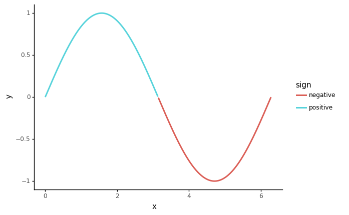

# plyrda

Probably the closest port of [tidyr][1] + [dplyr][2] in python, using [pipda][3].

## Installtion

```shell
pip install -U plyrda
```

## Philosophy
- Try to keep API consistent with `tidyr`/`dplyr`
- Try not to change python's default behaviors (i.e, 0-based indexing)

## Example usage

```python
from plyrda import f
from plyrda.verbs import mutate, filter
from plyrda.funcs import if_else
from plyrda.helpers import tibble

df = tibble(
    x=range(4),
    y=['zero', 'one', 'two', 'three']
)
df >> mutate(z=f.x)
"""# output
   x      y  z
0  0   zero  0
1  1    one  1
2  2    two  2
3  3  three  3
"""

df >> mutate(z=if_else(f.x>1, 1, 0))
"""# output:
   x      y  z
0  0   zero  0
1  1    one  0
2  2    two  1
3  3  three  1
"""

df >> filter(f.x>1)
"""# output:
   x      y
2  2    two
3  3  three
"""

df >> mutate(z=if_else(f.x>1, 1, 0)) >> filter(f.z==1)
"""# output:
   x      y  z
2  2    two  1
3  3  three  1
"""
```

```python
# works with plotnine
import numpy
from pipda import register_verb, register_func
from plotnine import ggplot, aes, geom_line

sin = register_func(None, func=numpy.sin)

df = tibble(x=numpy.linspace(0, 2*numpy.pi, 500))
(
    df >>
        mutate(y=sin(f.x), sign=if_else(f.y>=0, "positive", "negative")) >>
        ggplot(aes(x='x', y='y'))
) + geom_line(aes(color='sign'), size=1.5)
```



## Examples

To compare with `dplyr`'s and `tidyr`'s APIs, see:

- https://dplyr.tidyverse.org/reference/index.html and
- https://tidyr.tidyverse.org/reference/index.html

### dplyr - One table verbs

- [x] [`arrange()`](https://mybinder.org/v2/gh/pwwang/plyrda/HEAD?filepath=examples%2Farrange.ipynb): Arrange rows by column values
- [x] [`count()`, `tally()`, `add_count()`, `add_tally()`](https://mybinder.org/v2/gh/pwwang/plyrda/HEAD?filepath=examples%2Fcount.ipynb): Count observations by group
- [x] [`distinct()`](https://mybinder.org/v2/gh/pwwang/plyrda/HEAD?filepath=examples%2Fdistinct.ipynb): Subset distinct/unique rows
- [x] [`filter()`](https://mybinder.org/v2/gh/pwwang/plyrda/HEAD?filepath=examples%2Ffilter.ipynb): Subset rows using column values
- [x] [`mutate()`, `transmute()`](https://mybinder.org/v2/gh/pwwang/plyrda/HEAD?filepath=examples%2Fmutate.ipynb): Create, modify, and delete columns
- [x] [`pull()`](https://mybinder.org/v2/gh/pwwang/plyrda/HEAD?filepath=examples%2Fpull.ipynb): Extract a single column
- [x] [`relocate()`](https://mybinder.org/v2/gh/pwwang/plyrda/HEAD?filepath=examples%2Frelocate.ipynb): Change column order
- [x] [`rename()`, `rename_with()`](https://mybinder.org/v2/gh/pwwang/plyrda/HEAD?filepath=examples%2Frename.ipynb): Rename columns
- [x] [`select()`](https://mybinder.org/v2/gh/pwwang/plyrda/HEAD?filepath=examples%2Fselect.ipynb): Subset columns using their names and types
- [x] [`summarise()`, `summarize()`](https://mybinder.org/v2/gh/pwwang/plyrda/HEAD?filepath=examples%2Fsummarise.ipynb): Summarise each group to fewer rows
- [x] [`slice()`, `slice_head()`, `slice_tail()`, `slice_min()`, `slice_max()`, `slice_sample()`](https://mybinder.org/v2/gh/pwwang/plyrda/HEAD?filepath=examples%2Fslice.ipynb): Subset rows using their positions (TODO: implement groupby-aware `slice`)

### dplyr - Two table verbs
- [x] [`bind_rows()`, `bind_cols()`](https://mybinder.org/v2/gh/pwwang/plyrda/HEAD?filepath=examples%2Fbind.ipynb): Efficiently bind multiple data frames by row and column
- [x] [`inner_join()`, `left_join()`, `right_join()`, `full_join()`](https://mybinder.org/v2/gh/pwwang/plyrda/HEAD?filepath=examples%2Fmutate-joins.ipynb): Mutating joins
- [x] [`nest_join()`](https://mybinder.org/v2/gh/pwwang/plyrda/HEAD?filepath=examples%2Fnest_join.ipynb): Nest join (TODO: check API consistency)
- [x] [`semi_join()`, `anti_join()`](https://mybinder.org/v2/gh/pwwang/plyrda/HEAD?filepath=examples%2Ffilter-joins.ipynb): Filtering joins (TODO: warning when `by` is not specified)

### dplyr - Grouping
- [x] [`group_by()`](https://mybinder.org/v2/gh/pwwang/plyrda/HEAD?filepath=examples%2Fgroup_by) [`ungroup()`](https://mybinder.org/v2/gh/pwwang/plyrda/HEAD?filepath=examples%2Fgroup_by): Group by one or more variables
- [x] `group_cols()`: Select grouping variables
- [x] [`rowwise()`](https://mybinder.org/v2/gh/pwwang/plyrda/HEAD?filepath=examples%2Frowwise): Group input by rows

### dplyr - Vector functions
- [x] [`across()`, `c_across()`](https://mybinder.org/v2/gh/pwwang/plyrda/HEAD?filepath=examples%2Facross.ipynb): Apply a function (or a set of functions) to a set of columns
- [x] `between()`: No need, use `a < x < b` in python instead
- [x] [`case_when()`](https://mybinder.org/v2/gh/pwwang/plyrda/HEAD?filepath=examples%2Fcase_when.ipynb): A general vectorised if
- [x] [`coalesce()`](https://mybinder.org/v2/gh/pwwang/plyrda/HEAD?filepath=examples%2Fcoalesce.ipynb): Find first non-missing element
- [x] [`cumall()`, `cumany()`, `cummean()`](https://mybinder.org/v2/gh/pwwang/plyrda/HEAD?filepath=examples%2Fcumall.ipynb): Cumulativate versions of any, all, and mean
- [x] [`desc()`](https://mybinder.org/v2/gh/pwwang/plyrda/HEAD?filepath=examples%2Fdesc.ipynb): Descending order
- [x] [`if_else()`](https://mybinder.org/v2/gh/pwwang/plyrda/HEAD?filepath=examples%2Fif_else.ipynb): Vectorised if
- [x] [`lag()`, `lead()`](https://mybinder.org/v2/gh/pwwang/plyrda/HEAD?filepath=examples%2Flead-lag.ipynb): Compute lagged or leading values
- [x] `order_by()`: A helper function for ordering window function output (will not be implemented). The behavior is implemented in the functions themselves (i.e, `lead` and `lag`).
- [x] [`n()`, `cur_data()`, `cur_data_all()`, `cur_group()`, `cur_group_id()`, `cur_group_rows()`, `cur_column()`](https://mybinder.org/v2/gh/pwwang/plyrda/HEAD?filepath=examples%2Fcontext.ipynb): Context dependent expressions
- [x] [`n_distinct()`](https://mybinder.org/v2/gh/pwwang/plyrda/HEAD?filepath=examples%2Fn_distinct.ipynb): Efficiently count the number of unique values in a set of vector
- [x] [`na_if()`](https://mybinder.org/v2/gh/pwwang/plyrda/HEAD?filepath=examples%2Fna_if.ipynb): Convert values to NA
- [x] [`near()`](https://mybinder.org/v2/gh/pwwang/plyrda/HEAD?filepath=examples%2Fnear.ipynb): Compare two numeric vectors
- [ ] [`nth()`, `first()`, `last()`](https://mybinder.org/v2/gh/pwwang/plyrda/HEAD?filepath=examples%2Fnth.ipynb): Extract the first, last or nth value from a vector
- [x] [`row_number()`, `ntile()`, `min_rank()`, `dense_rank()`, `percent_rank()`, `cume_dist()`](https://mybinder.org/v2/gh/pwwang/plyrda/HEAD?filepath=examples%2Franking.ipynb): Windowed rank functions.
- [ ] [`recode()`, `recode_factor()`](https://mybinder.org/v2/gh/pwwang/plyrda/HEAD?filepath=examples%2Frecode.ipynb): Recode values

### dplyr - Data
- [x] `band_members`, `band_instruments`, `band_instruments2`: Band membership
- [x] `starwars`: Starwars characters
- [x] `storms`: Storm tracks data

### dplyr - Remote tables
- [ ] [`auto_copy()`](https://mybinder.org/v2/gh/pwwang/plyrda/HEAD?filepath=examples%2Fauto_copy.ipynb): Copy tables to same source, if necessary
- [ ] [`compute()`, `collect()`, `collapse()`](https://mybinder.org/v2/gh/pwwang/plyrda/HEAD?filepath=examples%2Fcompute.ipynb): Force computation of a database query
- [ ] [`copy_to()`](https://mybinder.org/v2/gh/pwwang/plyrda/HEAD?filepath=examples%2Fcopy_to.ipynb): Copy a local data frame to a remote src
- [ ] [`ident()`](https://mybinder.org/v2/gh/pwwang/plyrda/HEAD?filepath=examples%2Fident.ipynb): Flag a character vector as SQL identifiers
- [ ] [`explain()`, `show_query()`](https://mybinder.org/v2/gh/pwwang/plyrda/HEAD?filepath=examples%2Fexplain.ipynb): Explain details of a tbl
- [ ] [`tbl()`, `is.tbl()`](https://mybinder.org/v2/gh/pwwang/plyrda/HEAD?filepath=examples%2Ftbl.ipynb): Create a table from a data source
- [ ] [`sql()`](https://mybinder.org/v2/gh/pwwang/plyrda/HEAD?filepath=examples%2Fsql.ipynb): SQL escaping.

### dplyr - Experimental

Experimental functions are a testing ground for new approaches that we believe to be worthy of greater exposure. There is no guarantee that these functions will stay around in the future, so please reach out if you find them useful.

- [ ] [`group_map()`, `group_modify()`, `group_walk()`](https://mybinder.org/v2/gh/pwwang/plyrda/HEAD?filepath=examples%2Fgroup_map.ipynb): Apply a function to each group
- [ ] [`group_trim()`](https://mybinder.org/v2/gh/pwwang/plyrda/HEAD?filepath=examples%2Fgroup_trim.ipynb): Trim grouping structure
- [ ] [`group_split()`](https://mybinder.org/v2/gh/pwwang/plyrda/HEAD?filepath=examples%2Fgroup_split.ipynb): Split data frame by groups
- [ ] [`with_groups()`](https://mybinder.org/v2/gh/pwwang/plyrda/HEAD?filepath=examples%2Fwith_groups.ipynb): Perform an operation with temporary groups


### tidyr - Pivoting


**Pivoting** changes the representation of a rectangular dataset, without changing the data inside of it.

- [x] [`pivot_longer()`](htts://pwwang.github.io/plyrda/reference/pivot_longer.ipynb): Pivot data from wide to long
- [ ] [`pivot_wider()`](htts://pwwang.github.io/plyrda/reference/pivot_wider.ipynb): Pivot data from long to wide
- [ ] [`spread()`](htts://pwwang.github.io/plyrda/reference/spread.ipynb): Spread a key-value pair across multiple columns
- [ ] [`gather()`](htts://pwwang.github.io/plyrda/reference/gather.ipynb): Gather columns into key-value pairs

### tidyr - Rectangling

**Rectangling** turns deeply nested lists into tidy tibbles.

- [ ] [`hoist()`, `unnest_longer()`, `unnest_wider()`, `unnest_auto()`](htts://pwwang.github.io/plyrda/reference/unnest_auto.ipynb): Rectangle a nested list into a tidy tibble

### tidyr - Nesting


**Nesting** uses alternative representation of grouped data where a group becomes a single row containing a nested data frame.

- [ ] [`nest()`, `unnest()`](htts://pwwang.github.io/plyrda/reference/unnest.ipynb): Nest and unnest

### tidyr - Character vectors


Multiple variables are sometimes pasted together into a single column, and these tools help you separate back out into individual columns.

- [ ] [`extract()`](htts://pwwang.github.io/plyrda/reference/extract.ipynb): Extract a character column into multiple columns using regular expression groups
- [ ] [`separate()`](htts://pwwang.github.io/plyrda/reference/separate.ipynb): Separate a character column into multiple columns with a regular expression or numeric locations
- [ ] [`separate_rows()`](htts://pwwang.github.io/plyrda/reference/separate_rows.ipynb): Separate a collapsed column into multiple rows
- [ ] [`unite()`](htts://pwwang.github.io/plyrda/reference/unite.ipynb): Unite multiple columns into one by pasting strings together

### tidyr - Missing values


Tools for converting between implicit (absent rows) and explicit (`NA`) missing values, and for handling explicit `NA`s.

- [ ] [`complete()`](htts://pwwang.github.io/plyrda/reference/complete.ipynb): Complete a data frame with missing combinations of data
- [ ] [`drop_na()`](htts://pwwang.github.io/plyrda/reference/drop_na.ipynb): Drop rows containing missing values
- [ ] [`expand()`, `crossing()`, `nesting()`](htts://pwwang.github.io/plyrda/reference/nesting.ipynb): Expand data frame to include all possible combinations of values
- [ ] [`expand_grid()`](htts://pwwang.github.io/plyrda/reference/expand_grid.ipynb): Create a tibble from all combinations of inputs
- [ ] [`fill()`](htts://pwwang.github.io/plyrda/reference/fill.ipynb): Fill in missing values with previous or next value
- [ ] [`full_seq()`](htts://pwwang.github.io/plyrda/reference/full_seq.ipynb): Create the full sequence of values in a vector
- [ ] [`replace_na()`](htts://pwwang.github.io/plyrda/reference/replace_na.ipynb): Replace NAs with specified values

### tidyr - Miscellanea

- [ ] [`chop()`, `unchop()`](htts://pwwang.github.io/plyrda/reference/chop.ipynb): Chop and unchop
- [ ] [`pack()`, `unpack()`](htts://pwwang.github.io/plyrda/reference/pack.ipynb): Pack and unpack
- [ ] [`uncount()`](htts://pwwang.github.io/plyrda/reference/uncount.ipynb): "Uncount" a data frame

### tidyr - Data

- [x] `billboard`: Song rankings for billboard top 100 in the year 2000
- [x] `construction`: Completed construction in the US in 2018
- [x] `fish_encounters`: Fish encounters
- [x] `relig_income`: Pew religion and income survey
- [x] `smiths`: Some data about the Smith family
- [x] `table1`, `table3`, `table4a`, `table4b`, `table5`: Example tabular representations
- [x] `us_rent_income`: US rent and income data
- [x] `who`, `population`: World Health Organization TB data
- [x] `world_bank_pop`: Population data from the world bank

### plyrda - Specific verbs and functions

- [x] [`get`](https://mybinder.org/v2/gh/pwwang/plyrda/HEAD?filepath=examples%2Fget.ipynb): Get an element, or a subset of a dataframe.

[1]: https://tidyr.tidyverse.org/index.html
[2]: https://dplyr.tidyverse.org/index.html
[3]: https://github.com/pwwang/pipda
