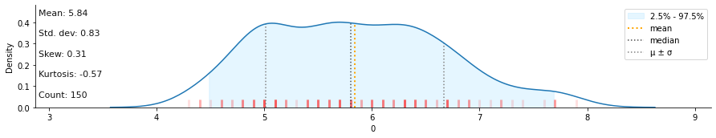

# datar

Port of R data packages ([tidyr][1], [dplyr][2], [tibble][4], etc) in python, using [pipda][3].

<!-- badges -->

[API][5]

## Installtion

```shell
pip install -U datar
```

## Philosophy
- Try to keep APIs with the original ones from those R packages
- Try not to change python's default behaviors (i.e, 0-based indexing)

## Example usage

```python
from datar import f
from datar.dplyr import mutate, filter, if_else
from datar.tibble import tibble

df = tibble(
    x=range(4),
    y=['zero', 'one', 'two', 'three']
)
df >> mutate(z=f.x)
"""# output
   x      y  z
0  0   zero  0
1  1    one  1
2  2    two  2
3  3  three  3
"""

df >> mutate(z=if_else(f.x>1, 1, 0))
"""# output:
   x      y  z
0  0   zero  0
1  1    one  0
2  2    two  1
3  3  three  1
"""

df >> filter(f.x>1)
"""# output:
   x      y
2  2    two
3  3  three
"""

df >> mutate(z=if_else(f.x>1, 1, 0)) >> filter(f.z==1)
"""# output:
   x      y  z
2  2    two  1
3  3  three  1
"""
```

```python
# works with plotnine
import numpy
from datar.base import sin, pi
from plotnine import ggplot, aes, geom_line, theme_classic

df = tibble(x=numpy.linspace(0, 2*pi, 500))
(
    df >>
        mutate(y=sin(f.x), sign=if_else(f.y>=0, "positive", "negative")) >>
        ggplot(aes(x='x', y='y')) + theme_classic()
) + geom_line(aes(color='sign'), size=1.2)
```


```python
# very easy to integrate with other libraries
# for example: klib
import klib
from pipda import register_verb
from datar.datasets import iris
from datar.dplyr import pull

dist_plot = register_verb(func=klib.dist_plot)
iris >> pull(f.Sepal_Length) >> dist_plot()
```



## Examples

To compare with `dplyr`'s and `tidyr`'s APIs, see:

- https://dplyr.tidyverse.org/reference/index.html and
- https://tidyr.tidyverse.org/reference/index.html

### dplyr - One table verbs

- [x] [`arrange()`](https://mybinder.org/v2/gh/pwwang/datar/HEAD?filepath=examples%2Farrange.ipynb): Arrange rows by column values
- [x] [`count()`, `tally()`, `add_count()`, `add_tally()`](https://mybinder.org/v2/gh/pwwang/datar/HEAD?filepath=examples%2Fcount.ipynb): Count observations by group
- [x] [`distinct()`](https://mybinder.org/v2/gh/pwwang/datar/HEAD?filepath=examples%2Fdistinct.ipynb): Subset distinct/unique rows
- [x] [`filter()`](https://mybinder.org/v2/gh/pwwang/datar/HEAD?filepath=examples%2Ffilter.ipynb): Subset rows using column values
- [x] [`mutate()`, `transmute()`](https://mybinder.org/v2/gh/pwwang/datar/HEAD?filepath=examples%2Fmutate.ipynb): Create, modify, and delete columns
- [x] [`pull()`](https://mybinder.org/v2/gh/pwwang/datar/HEAD?filepath=examples%2Fpull.ipynb): Extract a single column
- [x] [`relocate()`](https://mybinder.org/v2/gh/pwwang/datar/HEAD?filepath=examples%2Frelocate.ipynb): Change column order
- [x] [`rename()`, `rename_with()`](https://mybinder.org/v2/gh/pwwang/datar/HEAD?filepath=examples%2Frename.ipynb): Rename columns
- [x] [`select()`](https://mybinder.org/v2/gh/pwwang/datar/HEAD?filepath=examples%2Fselect.ipynb): Subset columns using their names and types
- [x] [`summarise()`, `summarize()`](https://mybinder.org/v2/gh/pwwang/datar/HEAD?filepath=examples%2Fsummarise.ipynb): Summarise each group to fewer rows
- [x] [`slice()`, `slice_head()`, `slice_tail()`, `slice_min()`, `slice_max()`, `slice_sample()`](https://mybinder.org/v2/gh/pwwang/datar/HEAD?filepath=examples%2Fslice.ipynb): Subset rows using their positions (TODO: implement groupby-aware `slice`)

### dplyr - Two table verbs
- [x] [`bind_rows()`, `bind_cols()`](https://mybinder.org/v2/gh/pwwang/datar/HEAD?filepath=examples%2Fbind.ipynb): Efficiently bind multiple data frames by row and column
- [x] [`inner_join()`, `left_join()`, `right_join()`, `full_join()`](https://mybinder.org/v2/gh/pwwang/datar/HEAD?filepath=examples%2Fmutate-joins.ipynb): Mutating joins
- [x] [`nest_join()`](https://mybinder.org/v2/gh/pwwang/datar/HEAD?filepath=examples%2Fnest_join.ipynb): Nest join (TODO: check API consistency)
- [x] [`semi_join()`, `anti_join()`](https://mybinder.org/v2/gh/pwwang/datar/HEAD?filepath=examples%2Ffilter-joins.ipynb): Filtering joins (TODO: warning when `by` is not specified)

### dplyr - Grouping
- [x] [`group_by()`](https://mybinder.org/v2/gh/pwwang/datar/HEAD?filepath=examples%2Fgroup_by) [`ungroup()`](https://mybinder.org/v2/gh/pwwang/datar/HEAD?filepath=examples%2Fgroup_by): Group by one or more variables
- [x] `group_cols()`: Select grouping variables
- [x] [`rowwise()`](https://mybinder.org/v2/gh/pwwang/datar/HEAD?filepath=examples%2Frowwise): Group input by rows

### dplyr - Vector functions
- [x] [`across()`, `c_across()`](https://mybinder.org/v2/gh/pwwang/datar/HEAD?filepath=examples%2Facross.ipynb): Apply a function (or a set of functions) to a set of columns
- [x] `between()`: No need, use `a < x < b` in python instead
- [x] [`case_when()`](https://mybinder.org/v2/gh/pwwang/datar/HEAD?filepath=examples%2Fcase_when.ipynb): A general vectorised if
- [x] [`coalesce()`](https://mybinder.org/v2/gh/pwwang/datar/HEAD?filepath=examples%2Fcoalesce.ipynb): Find first non-missing element
- [x] [`cumall()`, `cumany()`, `cummean()`](https://mybinder.org/v2/gh/pwwang/datar/HEAD?filepath=examples%2Fcumall.ipynb): Cumulativate versions of any, all, and mean
- [x] [`desc()`](https://mybinder.org/v2/gh/pwwang/datar/HEAD?filepath=examples%2Fdesc.ipynb): Descending order
- [x] [`if_else()`](https://mybinder.org/v2/gh/pwwang/datar/HEAD?filepath=examples%2Fif_else.ipynb): Vectorised if
- [x] [`lag()`, `lead()`](https://mybinder.org/v2/gh/pwwang/datar/HEAD?filepath=examples%2Flead-lag.ipynb): Compute lagged or leading values
- [x] `order_by()`: A helper function for ordering window function output (will not be implemented). The behavior is implemented in the functions themselves (i.e, `lead` and `lag`).
- [x] [`n()`, `cur_data()`, `cur_data_all()`, `cur_group()`, `cur_group_id()`, `cur_group_rows()`, `cur_column()`](https://mybinder.org/v2/gh/pwwang/datar/HEAD?filepath=examples%2Fcontext.ipynb): Context dependent expressions
- [x] [`n_distinct()`](https://mybinder.org/v2/gh/pwwang/datar/HEAD?filepath=examples%2Fn_distinct.ipynb): Efficiently count the number of unique values in a set of vector
- [x] [`na_if()`](https://mybinder.org/v2/gh/pwwang/datar/HEAD?filepath=examples%2Fna_if.ipynb): Convert values to NA
- [x] [`near()`](https://mybinder.org/v2/gh/pwwang/datar/HEAD?filepath=examples%2Fnear.ipynb): Compare two numeric vectors
- [x] [`nth()`, `first()`, `last()`](https://mybinder.org/v2/gh/pwwang/datar/HEAD?filepath=examples%2Fnth.ipynb): Extract the first, last or nth value from a vector
- [x] [`row_number()`, `ntile()`, `min_rank()`, `dense_rank()`, `percent_rank()`, `cume_dist()`](https://mybinder.org/v2/gh/pwwang/datar/HEAD?filepath=examples%2Franking.ipynb): Windowed rank functions.
- [x] [`recode()`, `recode_factor()`](https://mybinder.org/v2/gh/pwwang/datar/HEAD?filepath=examples%2Frecode.ipynb): Recode values

### dplyr - Data
- [x] `band_members`, `band_instruments`, `band_instruments2`: Band membership
- [x] `starwars`: Starwars characters
- [x] `storms`: Storm tracks data

### dplyr - Experimental

Experimental functions in dplyr.

- [x] [`group_map()`, `group_modify()`, `group_walk()`](https://mybinder.org/v2/gh/pwwang/datar/HEAD?filepath=examples%2Fgroup_map.ipynb): Apply a function to each group
- [x] [`group_trim()`](https://mybinder.org/v2/gh/pwwang/datar/HEAD?filepath=examples%2Fgroup_trim.ipynb): Trim grouping structure
- [x] [`group_split()`](https://mybinder.org/v2/gh/pwwang/datar/HEAD?filepath=examples%2Fgroup_split.ipynb): Split data frame by groups
- [x] [`with_groups()`](https://mybinder.org/v2/gh/pwwang/datar/HEAD?filepath=examples%2Fwith_groups.ipynb): Perform an operation with temporary groups


### tidyr - Pivoting


**Pivoting** changes the representation of a rectangular dataset, without changing the data inside of it.

- [x] [`pivot_longer()`](https://mybinder.org/v2/gh/pwwang/datar/HEAD?filepath=examples%2Fpivot_longer.ipynb): Pivot data from wide to long
- [x] [`pivot_wider()`](https://mybinder.org/v2/gh/pwwang/datar/HEAD?filepath=examples%2Fpivot_wider.ipynb): Pivot data from long to wide

### tidyr - Rectangling

**Rectangling** turns deeply nested lists into tidy tibbles.

- [ ] [`hoist()`, `unnest_longer()`, `unnest_wider()`, `unnest_auto()`](htts://pwwang.github.io/datar/reference/unnest_auto.ipynb): Rectangle a nested list into a tidy tibble

### tidyr - Nesting


**Nesting** uses alternative representation of grouped data where a group becomes a single row containing a nested data frame.

- [ ] [`nest()`, `unnest()`](htts://pwwang.github.io/datar/reference/unnest.ipynb): Nest and unnest

### tidyr - Character vectors


Multiple variables are sometimes pasted together into a single column, and these tools help you separate back out into individual columns.

- [x] [`extract()`](https://mybinder.org/v2/gh/pwwang/datar/HEAD?filepath=examples%2Fextract.ipynb): Extract a character column into multiple columns using regular expression groups
- [x] [`separate()`](https://mybinder.org/v2/gh/pwwang/datar/HEAD?filepath=examples%2Fseparate.ipynb): Separate a character column into multiple columns with a regular expression or numeric locations
- [x] [`separate_rows()`](https://mybinder.org/v2/gh/pwwang/datar/HEAD?filepath=examples%2Fseparate.ipynb): Separate a collapsed column into multiple rows
- [ ] [`unite()`](htts://pwwang.github.io/datar/reference/unite.ipynb): Unite multiple columns into one by pasting strings together

### tidyr - Missing values


Tools for converting between implicit (absent rows) and explicit (`NA`) missing values, and for handling explicit `NA`s.

- [ ] [`complete()`](htts://pwwang.github.io/datar/reference/complete.ipynb): Complete a data frame with missing combinations of data
- [ ] [`drop_na()`](htts://pwwang.github.io/datar/reference/drop_na.ipynb): Drop rows containing missing values
- [ ] [`expand()`, `crossing()`, `nesting()`](htts://pwwang.github.io/datar/reference/nesting.ipynb): Expand data frame to include all possible combinations of values
- [x] [`expand_grid()`](https://mybinder.org/v2/gh/pwwang/datar/HEAD?filepath=examples%2Fexpand_grid.ipynb): Create a tibble from all combinations of inputs
- [x] [`fill()`](https://mybinder.org/v2/gh/pwwang/datar/HEAD?filepath=examples%2Ffill.ipynb): Fill in missing values with previous or next value
- [x] [`replace_na()`](https://mybinder.org/v2/gh/pwwang/datar/HEAD?filepath=examples%2Freplace_na.ipynb): Replace NAs with specified values

### tidyr - Miscellanea

- [x] [`uncount()`](https://mybinder.org/v2/gh/pwwang/datar/HEAD?filepath=examples%2Funcount.ipynb): "Uncount" a data frame

### tidyr - Data

- [x] `billboard`: Song rankings for billboard top 100 in the year 2000
- [x] `construction`: Completed construction in the US in 2018
- [x] `fish_encounters`: Fish encounters
- [x] `relig_income`: Pew religion and income survey
- [x] `smiths`: Some data about the Smith family
- [x] `table1`, `table3`, `table4a`, `table4b`, `table5`: Example tabular representations
- [x] `us_rent_income`: US rent and income data
- [x] `who`, `population`: World Health Organization TB data
- [x] `world_bank_pop`: Population data from the world bank

### datar - Specific verbs and functions

- [x] [`get`](https://mybinder.org/v2/gh/pwwang/datar/HEAD?filepath=examples%2Fget.ipynb): Get an element, or a subset of a dataframe.
- [x] `flatten`: Flatten the whole dataframe into an array/list.

[1]: https://tidyr.tidyverse.org/index.html
[2]: https://dplyr.tidyverse.org/index.html
[3]: https://github.com/pwwang/pipda
[4]: https://tibble.tidyverse.org/index.html
[5]: https://pwwang.github.io/datar/
